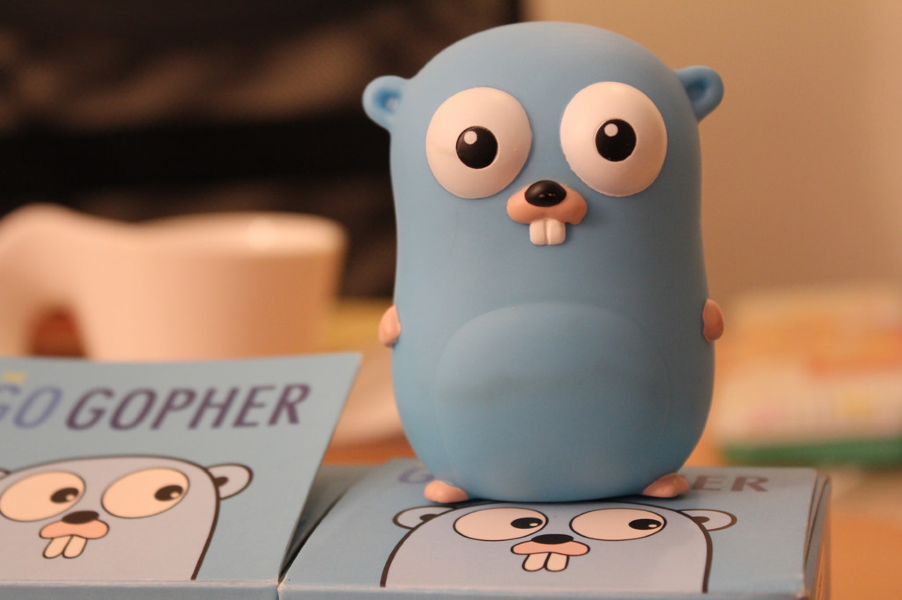

# 小天社区

- 小天社区，一个基于go-micro微服务架构的前后端分离社区系统。前台使用Vue + Element , 后端使用go-micro + etcd + grpc进行开发，使用 Jwt + go-oauth2做登录验证和权限校验，使用ElasticSearch和Solr作为全文检索服务，使用Github Actions完成博客的持续集成，文件支持上传七牛云。

[Gitee](<https://gitee.com/moxi159753/mogu_blog_v2>)
[Github](<https://github.com/moxi624/mogu_blog_v2>)
[开始阅读](README.md)